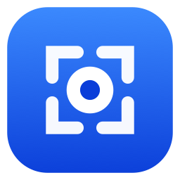

<p align="center">
  <a href="README_zh-CN.md">🇨🇳 中文文档</a>
  &nbsp;·&nbsp;
  <a href="README.md">🇬🇧 English</a>
</p>

<p align="center">
  
</p>

<h1 align="center">Jietu</h1>

<p align="center">
  <b>A native macOS screenshot & screen recording tool</b><br>
  Capture, annotate, pin, record — everything stays on your Mac.
</p>

<p align="center">
  <a href="https://github.com/ixxxxoooo/jietu/releases/latest"></a>
  <a href="https://github.com/ixxxxoooo/jietu/actions/workflows/ci.yml"></a>
  
  
  <a href="LICENSE"></a>
</p>

---

## ✨ Features

### Screenshot
- **Area capture** — pixel-perfect selection with green-dashed box, crosshair, and size label
- **Window capture** — auto-detect window bounds with green snap outline; optional macOS-style shadow
- **Full screen capture** — grab the entire display under cursor
- **Timed capture** — 3 / 5 / 10 second delay
- **Scrolling capture** — auto-stitch long pages (manual or auto-scroll)
- **Multi-display** — all monitors enter selection mode simultaneously

### Screen Recording
- **Region / Window / Full screen** modes
- **System audio + Microphone** recording with real-time mix
- **Pause / Resume** — paused segments are seamlessly removed
- MP4 (H.264), 30/60 fps, auto bitrate
- Post-recording **trim** and **GIF export**

### Annotation (Object-Based, Fully Editable)
- Tools: Select, Rectangle, Ellipse, Arrow, Line, Pen, Highlighter, Spotlight, Pixelate, Blur, Text, Counter, Eraser, Crop
- Inline editing — annotate directly on the capture overlay
- Move / resize / rotate handles; undo / redo (⌘Z / ⇧⌘Z)
- Style memory across sessions

### More
- 🔍 **Live Text (OCR)** — select & copy text from any screenshot or pin
- 🌐 **Translation** — powered by macOS built-in Translation framework
- 📌 **Pin to screen** — drag-resize, scroll-zoom, double-click to dismiss
- 🎨 **Color picker** — magnifier + hex copy
- ⌨️ **Global hotkeys** — 8 customizable actions (unbound by default)
- 🌙 **Theme** — system / light / dark
- 🌍 **i18n** — English & Simplified Chinese (system language or manual in Settings)

## 📦 Installation

### Download DMG

Download the latest `.dmg` from [Releases](https://github.com/ixxxxoooo/jietu/releases/latest), open it, and drag `Jietu.app` to `/Applications`.

> **First launch note:** The app is self-signed (no Developer ID / notarization), so macOS Gatekeeper blocks the first launch. Before opening, run this in Terminal — the DMG also ships **`安装说明（可复制命令）.txt`** with the same line, ready to copy:
>
> ```
> xattr -dr com.apple.quarantine /Applications/Jietu.app
> ```
>
> Alternatively: right-click **Jietu.app** → **Open** → **Open**.

### Grant Permissions

1. **Screen Recording** (required) — **System Settings › Privacy & Security › Screen & System Audio Recording**, then drag Jietu in (or click **+**) and turn it on, then **restart the app** (macOS requires a relaunch after granting). If Jietu is **already listed but the app still reports “not granted”**, that row is left over from an earlier build: select it, remove it with **−**, add it again, then restart.
2. **Accessibility** (optional) — only needed for auto-scroll in Scrolling Capture. Go to **System Settings › Privacy & Security › Accessibility** and add Jietu. No restart required.
3. **Notifications** (optional) — allow banners so “saved” feedback appears after writing to disk.

## 🛠 Build from Source

### Requirements

- macOS 26+ (Tahoe)
- Xcode 26+ / Swift 6

### Build

```bash
# Debug build (Jietu Dev.app — separate bundle ID, won't interfere with release)
xcodebuild -project Jietu.xcodeproj -scheme Jietu -configuration Debug \
  -destination 'platform=macOS' -derivedDataPath .build build

# Run
open ".build/Build/Products/Debug/Jietu Dev.app"
```

### Test

```bash
xcodebuild -project Jietu.xcodeproj -scheme Jietu -configuration Debug \
  -destination 'platform=macOS' test
```

### Package DMG (Release)

```bash
bash Scripts/build-dmg.sh
# Output: dist/Jietu-<version>.dmg
```

## 🏗 Architecture

```
Jietu/
  App/            App lifecycle & AppDelegate orchestration
  Core/
    Annotation/   Annotation model, geometry, hit-testing, renderer
    Capture/      ScreenCaptureKit capture, coordinate conversion, pixel sampling
    Diagnostics/  DEBUG-only CLI self-tests
    History/      Recent history (screenshots + recordings)
    Hotkeys/      Carbon global hotkeys & editor shortcuts
    ImageIO/      Crop / encode / save / clipboard / shutter sound
    Notifications/System notifications
    OCR/          Vision text recognition
    Permissions/  Screen Recording & Accessibility permission handling
    Recording/    Recording engine, dual-track audio mix, encoding, GIF export
    Scrolling/    Auto-scroll, row-signature stitching
    Settings/     Settings store, launch-at-login
  Overlay/        Capture overlay, selection, inline toolbar, Quick Access, Pin
  UI/
    Annotation/   Live Text overlay, text input
    DesignSystem/ Theme, glass components, design tokens
    History/      History panel views
    MenuBar/      Status bar menu
    Onboarding/   Permission onboarding wizard
    Permissions/  Drag-to-authorize panel
    Recording/    Recording border, control panel, video Quick Look
    Scrolling/    Scrolling capture control & live preview
    Settings/     Preferences window (sidebar + detail panes)
    Translation/  System Translation bridge
  Resources/      Assets, localization strings (en / zh-Hans)
JietuTests/       Swift Testing unit tests
Scripts/          Build & development scripts
```

### Design Principles

- **Dependency flow**: `App/ → Overlay/ & UI/ → Core/` (Core never imports UI)
- **Design system**: All UI styling goes through `UI/DesignSystem/` tokens
- **Single file ≤ ~500 lines**: Large types split into `+Extension` files
- **One source file = one test file**: Shared scaffolding in `JietuTests/TestSupport/`

## 📄 License

This project is licensed under the [MIT License](LICENSE).
